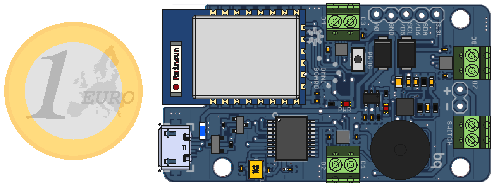

# OmniBoard

 

OmniBoard is a robotics controller board based on the ESP-12 module used to control up to three DC motors over wifi. It includes a 1S LiPo battery charger, a 3.5A boost circuit to ramp the voltage up to 5V for the motors and a hardware buzzer-based battery level indicator.

This board has been used to drive  <a href="https://github.com/bqlabs/miniloki">miniloki</a>:
 
This project is licensed under Creative Commons Attribution-ShareAlike 4.0 International (CC BY-SA 4.0)

